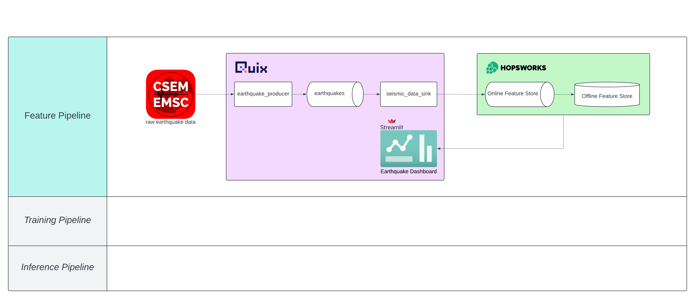

# Earthquake Predictor
The earthquake predictor is an application that pulls real-time earthquake data from [seismicportal.eu](https://www.seismicportal.eu/) and predicts the next earthquake. The data and predictions can be accessed through [this dashboard](tbd).

## Table of contents
- [Getting started](#getting-started)
- [Usage](#usage)
- [Structure](#structure)

## Getting started
### Clone the repository
```
git clone https://github.com/ajavelosa/earthquake-predictor.git
```
### Access the live dashboard
The live data is available [here](https://earthquake-dash-antonjavelosa-earthquakepredictor-production.deployments.quix.io/).

### Requirements
Python 3.10+, Apache Kafka 0.10+

## Usage
### Run the application
#### Setup a Redpanda broker
Redpanda will serve as our local Kafka Broker. This is where we will store our messages (i.e. streaming earthquake data).

The data is viewable from `localhost://8080` on your browser.
```
cd docker-compose
make start-redpanda
```
#### Get the earthquake data
While in the `docker-compose` folder:
```
make run-feature-pipeline
```
#### Launch the Streamlit dashboard
Go back to the root directory and run:
```
cd services/earthquake_dashboard
make run
```
#### Train a model
*Work in progress*
#### Generate a prediction
*Work in progress*

## Structure
The application follows a standard three-pipeline architecture:


- **feature pipeline:** generates features to be used by the model
- **training pipeline:** trains and generates models
- **inference pipeline:** generates predictions on unseen data

### Feature pipeline
Our feature pipeline is divided into three microservices

1. `earthquake_producer`: pulls data from [seismicportal.eu](https://www.seismicportal.eu/) and stores that data in a kafka topic
2. `seismic_data_sink`: consumes the data from (1) and pushes it to a Hopsworks Feature Store
3. `earthquake_dashboard`: queries the features from our Feature Store and displays the results on a Streamlit dashboard [here](https://earthquake-dash-antonjavelosa-earthquakepredictor-production.deployments.quix.io/)

### Training pipeline
*Work in progress*

### Inference pipeline
*Work in progress*
